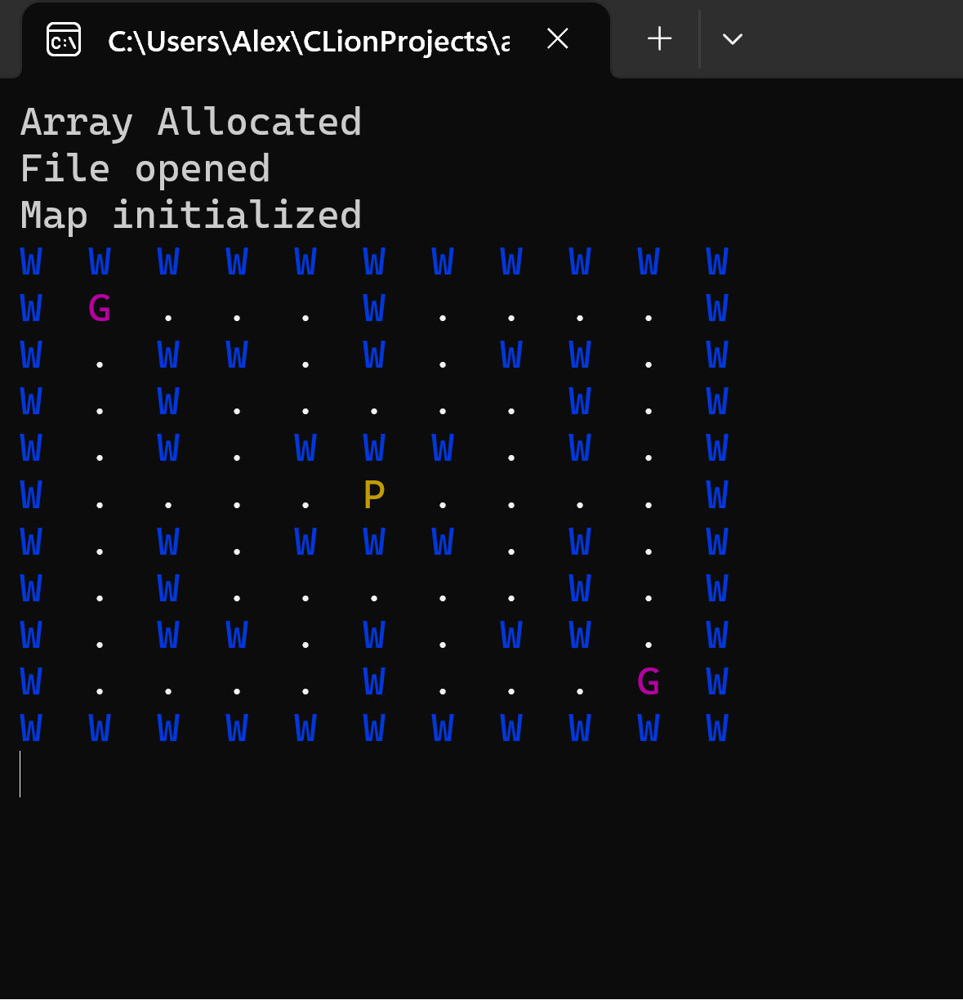
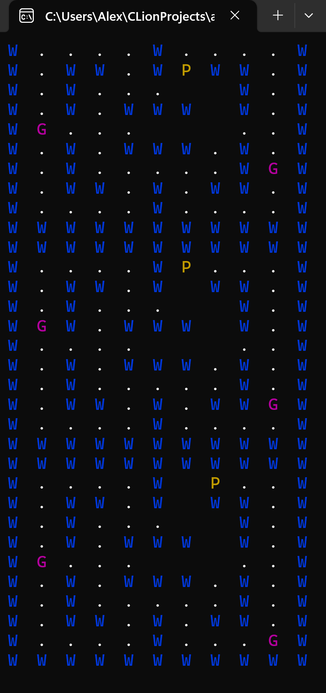
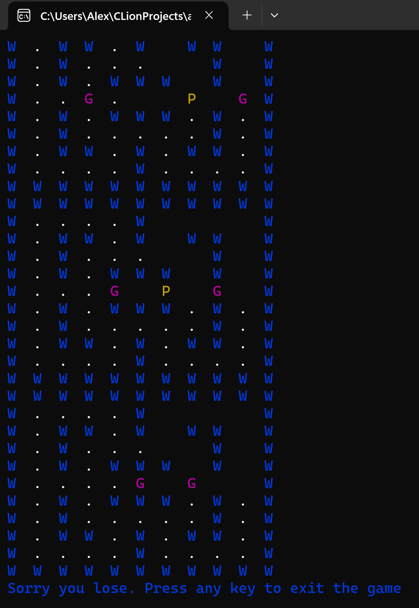
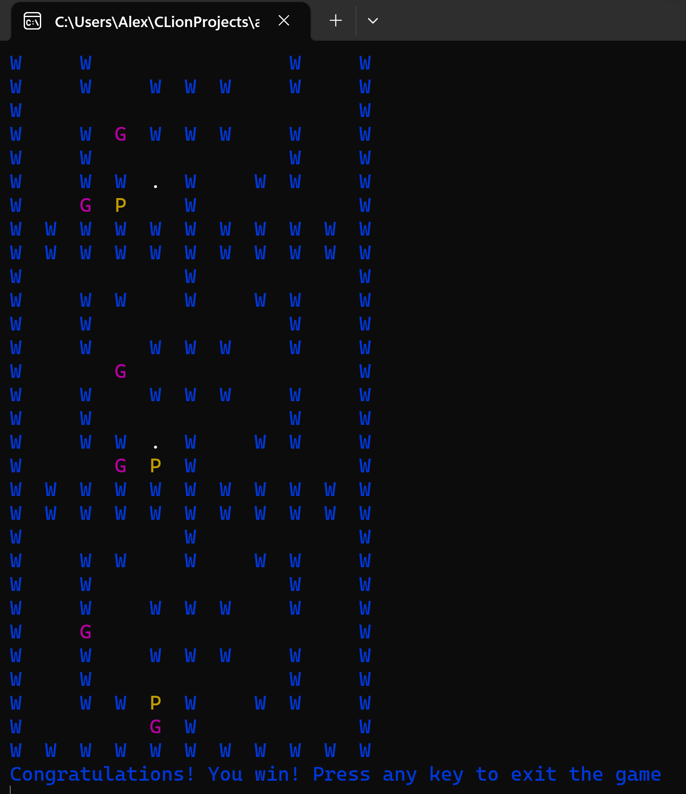

<h1>Pac-Man Remake</h1>

<h2>Problem Description</h2>
Project consists of fully functional retro video game Pac-man that can be played within your IDE's terminal. The assignment was given as a final summative to asses knowledge and programming ability within the language C. The program makes use of many functions to read the map from a file, receive user input to move Pac-man, and randomly move 2 ghosts around the map.
 

<h2>Languages and Utilities Used</h2>

- <b>C</b> 

<h2>Environments Used </h2>

- <b>Windows 11</b>
- <b>C Lion</b>

<h2>Program sample output photos:</h2>

Start of game:

  

Player and Ghost Movement:

  

Game Loss:

  

Game Win:

  

